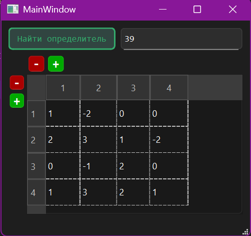

# DetCalculator

Простой калькулятор, реализованный на C++ с использованием библиотеки Qt для создания графического интерфейса пользователя (GUI). Этот калькулятор предназначен для расчета **определителя** (детерминанта) матрицы произвольного порядка.

## Описание

Приложение предоставляет возможность ввести элементы матрицы и рассчитать ее определитель. Пользователь может изменять размеры матрицы, добавлять или удалять строки и столбцы, а также корректировать значения элементов матрицы.

## Основные возможности

- Ввод элементов матрицы вручную.
- Автоматическая проверка введенных значений на допустимость.
- Расчет определителя матрицы любого порядка.
- Изменение размеров матрицы (добавление и удаление строк и столбцов).
- Удобный интерфейс для работы с матрицей.

## Формула для нахождения определителя

Формула для нахождения определителя матрицы методом Лапласа выглядит следующим образом:

$$\det(A) = \sum_{j=1}^{n}(-1)^{1+j} \cdot a_{1,j} \cdot M_{1,j}$$

Формула для нахождения минора 2x2:

$$M_{1,j} = a_{1,1} * a_{2,2} - a_{1,2} * a_{2,1}$$

Где:
- $a_{1,j}$ — элемент матрицы $A$, находящийся на пересечении первой строки и $j$-го столбца,
- $M_{1,j}$ — минор, полученный удалением первой строки и $j$-го столбца из исходной матрицы $A$,
- $(-1)^{1+j}$ — знак, зависящий от позиции элемента в матрице.

Пример для матрицы $3 \times 3$:

Пусть дана матрица $A$:

$$A = \begin{pmatrix} a_{1,1} & a_{1,2} & a_{1,3} \\ a_{2,1} & a_{2,2} & a_{2,3} \\ a_{3,1} & a_{3,2} & a_{3,3} \end{pmatrix}$$

Тогда определитель матрицы $A$ можно выразить как:

$$\det(A) = a_{1,1}M_{1,1} - a_{1,2}M_{1,2} + a_{1,3}M_{1,3}$$

Где:
- $M_{1,1}$ — минор, полученный удалением первой строки и первого столбца:

$$M_{1,1} = \begin{vmatrix} a_{2,2} & a_{2,3} \\ a_{3,2} & a_{3,3} \end{vmatrix}$$

- $M_{1,2}$ — минор, полученный удалением первой строки и второго столбца:

$$M_{1,2} = \begin{vmatrix} a_{2,1} & a_{2,3} \\ a_{3,1} & a_{3,3} \end{vmatrix}$$

- $M_{1,3}$ — минор, полученный удалением первой строки и третьего столбца:

$$M_{1,3} = \begin{vmatrix} a_{2,1} & a_{2,2} \\ a_{3,1} & a_{3,2} \end{vmatrix}$$

Процесс продолжается рекурсивно до тех пор, пока не достигнем матриц $2 \times 2$.

### Результат выполнения операции

## Требования

Для сборки и запуска этого проекта вам потребуется:

- Компьютер с установленной операционной системой Windows, Linux или macOS.
- Компилятор C++, поддерживающий стандарт C++11 или выше.
- Библиотека Qt версии 5.x или выше.
